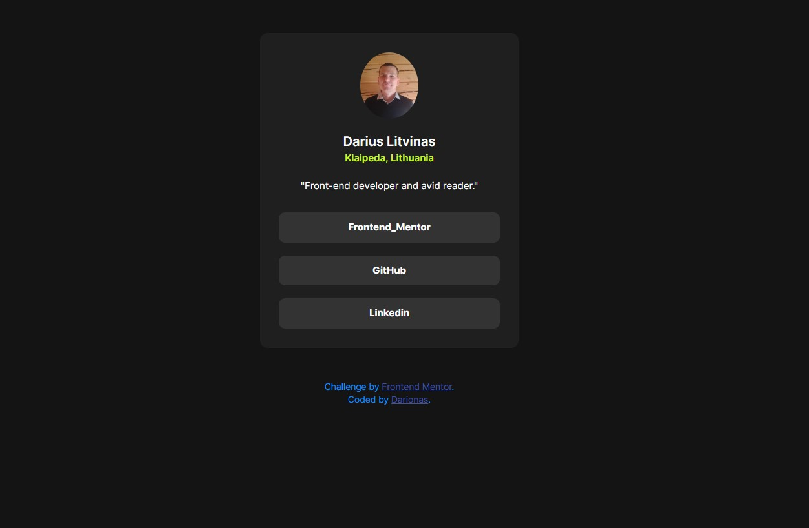

# Frontend Mentor - Social links profile solution

This is a solution to the [Social links profile challenge on Frontend Mentor](https://www.frontendmentor.io/challenges/social-links-profile-UG32l9m6dQ).

## Table of contents

- [Overview](#overview)
  - [The challenge](#the-challenge)
  - [Screenshot](#screenshot)
  - [Links](#links)
- [My process](#my-process)
  - [Built with](#built-with)
  - [What I learned](#what-i-learned)
  - [Continued development](#continued-development)
  - [Useful resources](#useful-resources)
- [Author](#author)
- [Acknowledgments](#acknowledgments)

## Overview

### The challenge

Users should be able to:

- See hover and focus states for all interactive elements on the page

### Screenshot

### Links

- Solution URL: (https://github.com/Darionas/social_links_profile)
- Live Site URL: (https://darionas.github.io/social_links_profile/)

## My process

### Built with

- Semantic HTML5 markup
- CSS custom properties
- Flexbox
- CSS Grid
- Mobile-first workflow
- AngularJS

But created with :heart:

### Used techniques

- BEM
- Accessibility

### What I learned

- Angular's default behaviour is to set display:inline for components. This means the component will take as much width as its content. In order to set a width on the component itself, you should define it's display property as display: inline-block or display: block.

### Continued development

- Learning AngularJS

### Useful resources

- [To set element width](https://stackoverflow.com/questions/74065064/cannot-set-width-of-component#answer-74065118) It let's define element width.

## Author

- Frontend Mentor - [@Darionas](https://www.frontendmentor.io/profile/Darionas)

- Linkedin - [Dario](https://www.linkedin.com/in/dario-dario-2a3118231/)

- GitHub - [Darionas](https://github.com/Darionas)

## Acknowledgments

- Thank you Frontend Mentor team for opportunity to try, practice, train yourself in different level challenges and gain invaluable experience.
